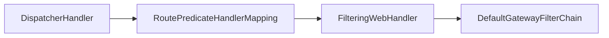

### springcloud gateway 初体验

依赖：

```
   <parent>
        <groupId>org.springframework.boot</groupId>
        <artifactId>spring-boot-starter-parent</artifactId>
        <version>2.0.5.RELEASE</version>
    </parent>

    <dependencyManagement>
        <dependencies>
            <dependency>
                <groupId>org.springframework.cloud</groupId>
                <artifactId>spring-cloud-dependencies</artifactId>
                <version>Finchley.SR1</version>
                <type>pom</type>
                <scope>import</scope>
            </dependency>
        </dependencies>
    </dependencyManagement>
	<dependency>
          <groupId>org.springframework.cloud</groupId>
          <artifactId>spring-cloud-starter-gateway</artifactId>
	</dependency>
```

体验版：

```
/**
* 
*/
@SpringBootApplication
@RestController
public class Application {

    public static void main(String[] args) {
        SpringApplication.run(Application.class, args);
    }
    /**
    * 初始化路由器
    * 这里使用了一个RouteLocatorBuilder的Bean去创建路由，除了创建路由RouteLocatorBuilder可以让你
    * 添加各种predicates和filters，predicates断言的意思（JDK8版本开始引入），顾名思义就是根据
    * 具体的请求的规则，由具体的route去处理，filters是各种过滤器，用来对请求做各种判断和修改
    * <p>
    * 当请求路径为get时，会将请求转发到http://httpbin.org:80，并且header会添加 Hello：World
    *
    */
    @Bean
    public RouteLocator myRoutes(RouteLocatorBuilder builder) {
       return builder.routes()
        .route(p -> p
        	//请求路径适配
            .path("/get")
            //添加过滤器 header中追加  Hello：World
            .filters(f -> f.addRequestHeader("Hello", "World"))
            // 路由转发目标地址
            .uri("http://httpbin.org:80"))
        .build();
    }
    
}
```


### 网关处理器

当请求到达网关时，会有各种web处理器对请求进行匹配和处理，流程如下




#### 请求分发器 dispatcherHandler

dispatcherHandler实现了webHandler接口，webHandler接口是用来处理web请求的。在dispatcherHandler的构造函数中会初始化HandlerMapping，核心处理的方法是handle（ServerWebExchange exchange），而HandlerMapping是一个定义了请求与处理器对象映射的接口且有多个实现类，如ControllerEndpointHandlerMapping和RouterFunctionMapping.

invokeHandler方法调用相应的WebHandler,获取该WebHandler对应的适配器。

```java
public class DispatcherHandler implements WebHandler, ApplicationContextAware {
    
    ……
    
	//根据请求匹配对应的出列器
    public Mono<Void> handle(ServerWebExchange exchange) {
        if (logger.isDebugEnabled()) {
            ServerHttpRequest request = exchange.getRequest();
            logger.debug("Processing " + request.getMethodValue() + " request for [" + request.getURI() + "]");
        }

        return this.handlerMappings == null ? Mono.error(HANDLER_NOT_FOUND_EXCEPTION) : Flux.fromIterable(this.handlerMappings).concatMap((mapping) -> {
            return mapping.getHandler(exchange);
        }).next().switchIfEmpty(Mono.error(HANDLER_NOT_FOUND_EXCEPTION)).flatMap((handler) -> {
            return this.invokeHandler(exchange, handler);
        }).flatMap((result) -> {
            return this.handleResult(exchange, result);
        });
    }
    
    private Mono<HandlerResult> invokeHandler(ServerWebExchange exchange, Object handler) {
		if (this.handlerAdapters != null) {
			for (HandlerAdapter handlerAdapter : this.handlerAdapters) {
				if (handlerAdapter.supports(handler)) {
					return handlerAdapter.handle(exchange, handler);
				}
			}
		}
		return Mono.error(new IllegalStateException("No HandlerAdapter: " + handler));
	}
    
    ……

}
```


#### 路由断言处理器 RoutePredicateHandlerMapping

RoutePredicateHandlerMapping 用于匹配具体的Route，并返回处理 Route 的 FilteringWebHandler

```java
public class RoutePredicateHandlerMapping extends AbstractHandlerMapping {
    private final FilteringWebHandler webHandler;
    private final RouteLocator routeLocator;

    /**
    * @param webHandler 网关过滤器
    * @param routeLocator 路由定位器
    * @param globalCorsProperties 
    *
    */
    public RoutePredicateHandlerMapping(FilteringWebHandler webHandler, RouteLocator routeLocator, GlobalCorsProperties globalCorsProperties) {
        this.webHandler = webHandler;
        this.routeLocator = routeLocator;
        this.setOrder(1);//设置该对象初始化的优先级
        this.setCorsConfigurations(globalCorsProperties.getCorsConfigurations());
    }
    ……
}
```

RoutePredicateHandlerMapping 的构造函数接受两个参数，FilteringWebHandler 网关过滤器 和 RouteLocator 路由定位器， setOrder(1) 用于设置该对象初始化的优先级。

Spring Cloud Gateway 的 GatewayWebfluxEndpoint 提供的 HTTP API 不需要经过  网关转发，它通过 RequestMappingHandlerMapping 进行请求匹配处理，因此需要将  RoutePredicateHandlerMapping 的优先级设置为 低于RequestMappingHandlerMapping。

```java
	protected Mono<?> getHandlerInternal(ServerWebExchange exchange) {
 		//设置网关处理器为 RoutePredicateHandlerMapping
        exchange.getAttributes().put(ServerWebExchangeUtils.GATEWAY_HANDLER_MAPPER_ATTR, this.getClass().getSimpleName());
        return this.lookupRoute(exchange).flatMap((r) -> {
            exchange.getAttributes().remove(ServerWebExchangeUtils.GATEWAY_PREDICATE_ROUTE_ATTR);
            if (this.logger.isDebugEnabled()) {
                this.logger.debug("Mapping [" + this.getExchangeDesc(exchange) + "] to " + r);
            }

            exchange.getAttributes().put(ServerWebExchangeUtils.GATEWAY_ROUTE_ATTR, r);
            return Mono.just(this.webHandler);
        }).switchIfEmpty(Mono.empty().then(Mono.fromRunnable(() -> {
            exchange.getAttributes().remove(ServerWebExchangeUtils.GATEWAY_PREDICATE_ROUTE_ATTR);
            if (this.logger.isTraceEnabled()) {
                this.logger.trace("No RouteDefinition found for [" + this.getExchangeDesc(exchange) + "]");
            }

        })));
    }

    //路由顺序匹配
    protected Mono<Route> lookupRoute(ServerWebExchange exchange) {
        return this.routeLocator.getRoutes().concatMap((route) -> {
            return Mono.just(route).filterWhen((r) -> {
                exchange.getAttributes().put(ServerWebExchangeUtils.GATEWAY_PREDICATE_ROUTE_ATTR, r.getId());
                return (Publisher)r.getPredicate().apply(exchange);
            }).doOnError((e) -> {
                this.logger.error("Error applying predicate for route: " + route.getId(), e);
            }).onErrorResume((e) -> {
                return Mono.empty();
            });
        }).next().map((route) -> {
            if (this.logger.isDebugEnabled()) {
                this.logger.debug("Route matched: " + route.getId());
            }
            //校验路由有效性
            this.validateRoute(route, exchange);
            return route;
        });
    }
```


以上为获取 handler 的方法，匹配请求的Route，并返回处理 Route的过滤器 FilteringWebHandler。

首先设置GATEWAY_ HANDLER_ MAPPER_ ATTR 为 RoutePredicateHandlerMapping 的类名，

然后顺序匹配对应的 Route，RouteLocator 接口获取网关中定义的路由，并根据请求信息与路由定义的断言按照优先级匹配。

最后找到匹配的Route，并返回响应的处理器。


#### 过滤器处理器 FilteringWebHandler

FilteringWebHandler 通过创建所请求 Route 对应的 GatewayFilterChain， 在网关进行过滤处理

```java
public class FilteringWebHandler implements WebHandler {
    protected static final Log logger = LogFactory.getLog(FilteringWebHandler.class);
    private final List<GatewayFilter> globalFilters;

    public FilteringWebHandler(List<GlobalFilter> globalFilters) {
        this.globalFilters = loadFilters(globalFilters);
    }

    private static List<GatewayFilter> loadFilters(List<GlobalFilter> filters) {
        return (List)filters.stream().map((filter) -> {
        //适配 GatewayFilter
            FilteringWebHandler.GatewayFilterAdapter gatewayFilter = new FilteringWebHandler.GatewayFilterAdapter(filter);
            //是否实现了 Ordered，如果实现了，则返回OrderedGatewayFilter
            if (filter instanceof Ordered) {
                int order = ((Ordered)filter).getOrder();
                return new OrderedGatewayFilter(gatewayFilter, order);
            } else {
                return gatewayFilter;
            }
        }).collect(Collectors.toList());
    }

    public Mono<Void> handle(ServerWebExchange exchange) {
        Route route = (Route)exchange.getRequiredAttribute(ServerWebExchangeUtils.GATEWAY_ROUTE_ATTR);
        List<GatewayFilter> gatewayFilters = route.getFilters();
        List<GatewayFilter> combined = new ArrayList(this.globalFilters);
        //加入全局过滤器
        combined.addAll(gatewayFilters);
        //过滤器排序
        AnnotationAwareOrderComparator.sort(combined);
        logger.debug("Sorted gatewayFilterFactories: " + combined);
        //按照优先级对请求进行过滤
        return (new FilteringWebHandler.DefaultGatewayFilterChain(combined)).filter(exchange);
    }
}
```


全局变量 globalFilters 是Spring Cloud Gateway 定义的全局过滤器，构造函数通过传入全局过滤器，对过滤器进行适配。因为过滤器有优先级，loadFilters 该方法主要是判断过滤器是否实现了 Ordered 接口，如果实现了则返回OrderedGatewayFilter，否则返回适配的过滤器。最后将适配的过滤器加入全局过滤器，并对过滤器进行排序，根据优先级对请求进行处理。

#### 生成过滤器链

FilteringWebHandler 内部静态类 DefaultGatewayFilterChain

```java
	private static class DefaultGatewayFilterChain implements GatewayFilterChain {
        private final int index;
        private final List<GatewayFilter> filters;

        public DefaultGatewayFilterChain(List<GatewayFilter> filters) {
            this.filters = filters;
            this.index = 0;
        }

        private DefaultGatewayFilterChain(FilteringWebHandler.DefaultGatewayFilterChain parent, int index) {
            this.filters = parent.getFilters();
            this.index = index;
        }

        public List<GatewayFilter> getFilters() {
            return this.filters;
        }

        public Mono<Void> filter(ServerWebExchange exchange) {
            return Mono.defer(() -> {
                if (this.index < this.filters.size()) {
                    GatewayFilter filter = (GatewayFilter)this.filters.get(this.index);
                    FilteringWebHandler.DefaultGatewayFilterChain chain = new FilteringWebHandler.DefaultGatewayFilterChain(this, this.index + 1);
                    return filter.filter(exchange, chain);
                } else {
                    return Mono.empty();
                }
            });
        }
    }
```

FilteringWebHandler 的 handle 方法，首先获取请求对应的路由过滤器和全局过滤器，并将两者合并。然后对过滤器进行排序。最后按照优先级生成过滤器链，对请求进行过滤处理。

过滤器链的生成是通过内部静态类 DefaultGatewayFilterChain 实现的，该类实现了GatewayFilterChain 接口，最后对请求按照过滤器优先级进行过滤。


### GatewayAutoConfiguration

GatewayAutoConfiguration 已经把 InMemoryRouteDefinitionRepository 注册成bean了，可以进行动态路由配置

```java
@Configuration
@ConditionalOnProperty(name = "spring.cloud.gateway.enabled", matchIfMissing = true)
@EnableConfigurationProperties
@AutoConfigureBefore({ HttpHandlerAutoConfiguration.class,
		WebFluxAutoConfiguration.class })
@AutoConfigureAfter({ GatewayLoadBalancerClientAutoConfiguration.class,
		GatewayClassPathWarningAutoConfiguration.class })
@ConditionalOnClass(DispatcherHandler.class)
public class GatewayAutoConfiguration {

	@Bean
	public StringToZonedDateTimeConverter stringToZonedDateTimeConverter() {
		return new StringToZonedDateTimeConverter();
	}

	@Bean
	public RouteLocatorBuilder routeLocatorBuilder(
			ConfigurableApplicationContext context) {
		return new RouteLocatorBuilder(context);
	}

	@Bean
	@ConditionalOnMissingBean
	public PropertiesRouteDefinitionLocator propertiesRouteDefinitionLocator(
			GatewayProperties properties) {
		return new PropertiesRouteDefinitionLocator(properties);
	}

	@Bean
	@ConditionalOnMissingBean(RouteDefinitionRepository.class)
	public InMemoryRouteDefinitionRepository inMemoryRouteDefinitionRepository() {
		return new InMemoryRouteDefinitionRepository();
	}

	@Bean
	@Primary
	public RouteDefinitionLocator routeDefinitionLocator(
			List<RouteDefinitionLocator> routeDefinitionLocators) {
		return new CompositeRouteDefinitionLocator(
				Flux.fromIterable(routeDefinitionLocators));
	}

	@Bean
	public RouteLocator routeDefinitionRouteLocator(GatewayProperties properties,
			List<GatewayFilterFactory> GatewayFilters,
			List<RoutePredicateFactory> predicates,
			RouteDefinitionLocator routeDefinitionLocator,
			@Qualifier("webFluxConversionService") ConversionService conversionService) {
		return new RouteDefinitionRouteLocator(routeDefinitionLocator, predicates,
				GatewayFilters, properties, conversionService);
	}
	
	……
}
```


####  InMemoryRouteDefinitionRepository

其提供了save和delete方法，这样就可以修改当前路由配置信息，路由配置信息修改完毕之后，再用spring的事件触发 <B>RefreshRoutesEvent</B> 事件来刷新路由就行了

```java

/**
 * @author Spencer Gibb
 */
public class InMemoryRouteDefinitionRepository implements RouteDefinitionRepository {

	private final Map<String, RouteDefinition> routes = synchronizedMap(
			new LinkedHashMap<String, RouteDefinition>());

     /**
     * 来自 RouteDefinitionWriter
     * <p>
     * 注：将路由信息保存到路由配置map中
     *
     * @param route
     */
	@Override
	public Mono<Void> save(Mono<RouteDefinition> route) {
		return route.flatMap(r -> {
			routes.put(r.getId(), r);
			return Mono.empty();
		});
	}

     /**
     * 来自 RouteDefinitionWriter
     * <p>
     * 注：将路由信息从路由配置map中移除
     *
     * @param routeId
     */
	@Override
	public Mono<Void> delete(Mono<String> routeId) {
		return routeId.flatMap(id -> {
			if (routes.containsKey(id)) {
				routes.remove(id);
				return Mono.empty();
			}
			return Mono.defer(() -> Mono.error(
					new NotFoundException("RouteDefinition not found: " + routeId)));
		});
	}

    
    /**
    * 实现RouteDefinitionLocator的方法
    * 将路由map所有values集合转换成Flux
    *
    * @return Flux路由器
    */
	@Override
	public Flux<RouteDefinition> getRouteDefinitions() {
		return Flux.fromIterable(routes.values());
	}

}
```


下次请求的时候就可以拿最新的路由配置了

顺序是：

1. RoutePredicateHandlerMapping的lookupRoute方法，由于路由刷新事件把路由缓存清了，所以重新获取
2. CompositeRouteLocator的getRoutes()方法遍历所有RouteLocator实现类的getRoutes方法
3. RouteDefinitionRouteLocator的getRoutes方法里重新获取了所有的路由定义，也就把我们刚刚用的事件添加的路由也获取了


#### RouteDefinitionRepository

```java
public interface RouteDefinitionRepository
		extends RouteDefinitionLocator, RouteDefinitionWriter {

}
```


#### RefreshRoutesEvent 事件刷新路由

```
/**
 * @author Spencer Gibb
 */
public class RefreshRoutesEvent extends ApplicationEvent {

	/**
	 * Create a new ApplicationEvent.
	 * @param source the object on which the event initially occurred (never {@code null})
	 */
	public RefreshRoutesEvent(Object source) {
		super(source);
	}

}
```


```

/**
 * @author Spencer Gibb
 */
public class CachingRouteLocator
		implements RouteLocator, ApplicationListener<RefreshRoutesEvent> {

	private final RouteLocator delegate;

	private final Flux<Route> routes;

	private final Map<String, List> cache = new HashMap<>();

	public CachingRouteLocator(RouteLocator delegate) {
		this.delegate = delegate;
		routes = CacheFlux.lookup(cache, "routes", Route.class)
				.onCacheMissResume(() -> this.delegate.getRoutes()
						.sort(AnnotationAwareOrderComparator.INSTANCE));
	}

	@Override
	public Flux<Route> getRoutes() {
		return this.routes;
	}

	/**
	 * Clears the routes cache.
	 * @return routes flux
	 */
	public Flux<Route> refresh() {
		this.cache.clear();
		return this.routes;
	}

	@Override
	public void onApplicationEvent(RefreshRoutesEvent event) {
		refresh();
	}

	@Deprecated
	/* for testing */ void handleRefresh() {
		refresh();
	}

}

```


### 读取requestBody

> 参考：https://www.cnblogs.com/cafebabe-yun/p/9328554.html