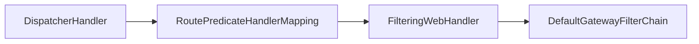
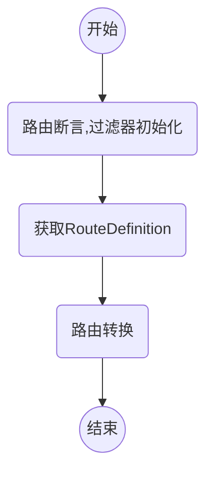

### springcloud gateway 初体验

依赖：

```
   <parent>
        <groupId>org.springframework.boot</groupId>
        <artifactId>spring-boot-starter-parent</artifactId>
        <version>2.0.5.RELEASE</version>
    </parent>

    <dependencyManagement>
        <dependencies>
            <dependency>
                <groupId>org.springframework.cloud</groupId>
                <artifactId>spring-cloud-dependencies</artifactId>
                <version>Finchley.SR1</version>
                <type>pom</type>
                <scope>import</scope>
            </dependency>
        </dependencies>
    </dependencyManagement>
	<dependency>
          <groupId>org.springframework.cloud</groupId>
          <artifactId>spring-cloud-starter-gateway</artifactId>
	</dependency>
```

体验版：

```
/**
* 
*/
@SpringBootApplication
@RestController
public class Application {

    public static void main(String[] args) {
        SpringApplication.run(Application.class, args);
    }
    /**
    * 初始化路由器
    * 这里使用了一个RouteLocatorBuilder的Bean去创建路由，除了创建路由RouteLocatorBuilder可以让你
    * 添加各种predicates和filters，predicates断言的意思（JDK8版本开始引入），顾名思义就是根据
    * 具体的请求的规则，由具体的route去处理，filters是各种过滤器，用来对请求做各种判断和修改
    * <p>
    * 当请求路径为get时，会将请求转发到http://httpbin.org:80，并且header会添加 Hello：World
    *
    */
    @Bean
    public RouteLocator myRoutes(RouteLocatorBuilder builder) {
       return builder.routes()
        .route(p -> p
        	//请求路径适配
            .path("/get")
            //添加过滤器 header中追加  Hello：World
            .filters(f -> f.addRequestHeader("Hello", "World"))
            // 路由转发目标地址
            .uri("http://httpbin.org:80"))
        .build();
    }
    
}
```


### 网关处理器

当请求到达网关时，会有各种web处理器对请求进行匹配和处理，流程如下




#### 请求分发器 dispatcherHandler

dispatcherHandler实现了webHandler接口，webHandler接口是用来处理web请求的。在dispatcherHandler的构造函数中会初始化HandlerMapping，核心处理的方法是handle（ServerWebExchange exchange），而HandlerMapping是一个定义了请求与处理器对象映射的接口且有多个实现类，如ControllerEndpointHandlerMapping和RouterFunctionMapping.

invokeHandler方法调用相应的WebHandler,获取该WebHandler对应的适配器。

```java
public class DispatcherHandler implements WebHandler, ApplicationContextAware {
    
    ……
    
	//根据请求匹配对应的出列器
    public Mono<Void> handle(ServerWebExchange exchange) {
        if (logger.isDebugEnabled()) {
            ServerHttpRequest request = exchange.getRequest();
            logger.debug("Processing " + request.getMethodValue() + " request for [" + request.getURI() + "]");
        }

        return this.handlerMappings == null ? Mono.error(HANDLER_NOT_FOUND_EXCEPTION) : Flux.fromIterable(this.handlerMappings).concatMap((mapping) -> {
            return mapping.getHandler(exchange);
        }).next().switchIfEmpty(Mono.error(HANDLER_NOT_FOUND_EXCEPTION)).flatMap((handler) -> {
            return this.invokeHandler(exchange, handler);
        }).flatMap((result) -> {
            return this.handleResult(exchange, result);
        });
    }
    
    private Mono<HandlerResult> invokeHandler(ServerWebExchange exchange, Object handler) {
		if (this.handlerAdapters != null) {
			for (HandlerAdapter handlerAdapter : this.handlerAdapters) {
				if (handlerAdapter.supports(handler)) {
					return handlerAdapter.handle(exchange, handler);
				}
			}
		}
		return Mono.error(new IllegalStateException("No HandlerAdapter: " + handler));
	}
    
    ……

}
```


#### 路由断言处理器 RoutePredicateHandlerMapping

RoutePredicateHandlerMapping 用于匹配具体的Route，并返回处理 Route 的 FilteringWebHandler

```java
public class RoutePredicateHandlerMapping extends AbstractHandlerMapping {
    private final FilteringWebHandler webHandler;
    private final RouteLocator routeLocator;

    /**
    * @param webHandler 网关过滤器
    * @param routeLocator 路由定位器
    * @param globalCorsProperties 
    *
    */
    public RoutePredicateHandlerMapping(FilteringWebHandler webHandler, RouteLocator routeLocator, GlobalCorsProperties globalCorsProperties) {
        this.webHandler = webHandler;
        this.routeLocator = routeLocator;
        this.setOrder(1);//设置该对象初始化的优先级
        this.setCorsConfigurations(globalCorsProperties.getCorsConfigurations());
    }
    ……
}
```

RoutePredicateHandlerMapping 的构造函数接受两个参数，FilteringWebHandler 网关过滤器 和 RouteLocator 路由定位器， setOrder(1) 用于设置该对象初始化的优先级。

Spring Cloud Gateway 的 GatewayWebfluxEndpoint 提供的 HTTP API 不需要经过  网关转发，它通过 RequestMappingHandlerMapping 进行请求匹配处理，因此需要将  RoutePredicateHandlerMapping 的优先级设置为 低于RequestMappingHandlerMapping。

```java
	protected Mono<?> getHandlerInternal(ServerWebExchange exchange) {
 		//设置网关处理器为 RoutePredicateHandlerMapping
        exchange.getAttributes().put(ServerWebExchangeUtils.GATEWAY_HANDLER_MAPPER_ATTR, this.getClass().getSimpleName());
        return this.lookupRoute(exchange).flatMap((r) -> {
            exchange.getAttributes().remove(ServerWebExchangeUtils.GATEWAY_PREDICATE_ROUTE_ATTR);
            if (this.logger.isDebugEnabled()) {
                this.logger.debug("Mapping [" + this.getExchangeDesc(exchange) + "] to " + r);
            }

            exchange.getAttributes().put(ServerWebExchangeUtils.GATEWAY_ROUTE_ATTR, r);
            return Mono.just(this.webHandler);
        }).switchIfEmpty(Mono.empty().then(Mono.fromRunnable(() -> {
            exchange.getAttributes().remove(ServerWebExchangeUtils.GATEWAY_PREDICATE_ROUTE_ATTR);
            if (this.logger.isTraceEnabled()) {
                this.logger.trace("No RouteDefinition found for [" + this.getExchangeDesc(exchange) + "]");
            }

        })));
    }

    //路由顺序匹配
    protected Mono<Route> lookupRoute(ServerWebExchange exchange) {
        return this.routeLocator.getRoutes().concatMap((route) -> {
            return Mono.just(route).filterWhen((r) -> {
                exchange.getAttributes().put(ServerWebExchangeUtils.GATEWAY_PREDICATE_ROUTE_ATTR, r.getId());
                return (Publisher)r.getPredicate().apply(exchange);
            }).doOnError((e) -> {
                this.logger.error("Error applying predicate for route: " + route.getId(), e);
            }).onErrorResume((e) -> {
                return Mono.empty();
            });
        }).next().map((route) -> {
            if (this.logger.isDebugEnabled()) {
                this.logger.debug("Route matched: " + route.getId());
            }
            //校验路由有效性
            this.validateRoute(route, exchange);
            return route;
        });
    }
```


以上为获取 handler 的方法，匹配请求的Route，并返回处理 Route的过滤器 FilteringWebHandler。

首先设置GATEWAY_ HANDLER_ MAPPER_ ATTR 为 RoutePredicateHandlerMapping 的类名，

然后顺序匹配对应的 Route，RouteLocator 接口获取网关中定义的路由，并根据请求信息与路由定义的断言按照优先级匹配。

最后找到匹配的Route，并返回响应的处理器。


#### 过滤器处理器 FilteringWebHandler

FilteringWebHandler 通过创建所请求 Route 对应的 GatewayFilterChain， 在网关进行过滤处理

```java
public class FilteringWebHandler implements WebHandler {
    protected static final Log logger = LogFactory.getLog(FilteringWebHandler.class);
    private final List<GatewayFilter> globalFilters;

    public FilteringWebHandler(List<GlobalFilter> globalFilters) {
        this.globalFilters = loadFilters(globalFilters);
    }

    private static List<GatewayFilter> loadFilters(List<GlobalFilter> filters) {
        return (List)filters.stream().map((filter) -> {
        //适配 GatewayFilter
            FilteringWebHandler.GatewayFilterAdapter gatewayFilter = new FilteringWebHandler.GatewayFilterAdapter(filter);
            //是否实现了 Ordered，如果实现了，则返回OrderedGatewayFilter
            if (filter instanceof Ordered) {
                int order = ((Ordered)filter).getOrder();
                return new OrderedGatewayFilter(gatewayFilter, order);
            } else {
                return gatewayFilter;
            }
        }).collect(Collectors.toList());
    }

    public Mono<Void> handle(ServerWebExchange exchange) {
        Route route = (Route)exchange.getRequiredAttribute(ServerWebExchangeUtils.GATEWAY_ROUTE_ATTR);
        List<GatewayFilter> gatewayFilters = route.getFilters();
        List<GatewayFilter> combined = new ArrayList(this.globalFilters);
        //加入全局过滤器
        combined.addAll(gatewayFilters);
        //过滤器排序
        AnnotationAwareOrderComparator.sort(combined);
        logger.debug("Sorted gatewayFilterFactories: " + combined);
        //按照优先级对请求进行过滤
        return (new FilteringWebHandler.DefaultGatewayFilterChain(combined)).filter(exchange);
    }
}
```


全局变量 globalFilters 是Spring Cloud Gateway 定义的全局过滤器，构造函数通过传入全局过滤器，对过滤器进行适配。因为过滤器有优先级，loadFilters 该方法主要是判断过滤器是否实现了 Ordered 接口，如果实现了则返回OrderedGatewayFilter，否则返回适配的过滤器。最后将适配的过滤器加入全局过滤器，并对过滤器进行排序，根据优先级对请求进行处理。

#### 生成过滤器链

FilteringWebHandler 内部静态类 DefaultGatewayFilterChain

```java
	private static class DefaultGatewayFilterChain implements GatewayFilterChain {
        private final int index;
        private final List<GatewayFilter> filters;

        public DefaultGatewayFilterChain(List<GatewayFilter> filters) {
            this.filters = filters;
            this.index = 0;
        }

        private DefaultGatewayFilterChain(FilteringWebHandler.DefaultGatewayFilterChain parent, int index) {
            this.filters = parent.getFilters();
            this.index = index;
        }

        public List<GatewayFilter> getFilters() {
            return this.filters;
        }

        public Mono<Void> filter(ServerWebExchange exchange) {
            return Mono.defer(() -> {
                if (this.index < this.filters.size()) {
                    GatewayFilter filter = (GatewayFilter)this.filters.get(this.index);
                    FilteringWebHandler.DefaultGatewayFilterChain chain = new FilteringWebHandler.DefaultGatewayFilterChain(this, this.index + 1);
                    return filter.filter(exchange, chain);
                } else {
                    return Mono.empty();
                }
            });
        }
    }
```

FilteringWebHandler 的 handle 方法，首先获取请求对应的路由过滤器和全局过滤器，并将两者合并。然后对过滤器进行排序。最后按照优先级生成过滤器链，对请求进行过滤处理。

过滤器链的生成是通过内部静态类 DefaultGatewayFilterChain 实现的，该类实现了GatewayFilterChain 接口，最后对请求按照过滤器优先级进行过滤。


### GatewayAutoConfiguration

GatewayAutoConfiguration 已经把 InMemoryRouteDefinitionRepository 注册成bean了，可以进行动态路由配置

```java
@Configuration
@ConditionalOnProperty(name = "spring.cloud.gateway.enabled", matchIfMissing = true)
@EnableConfigurationProperties
@AutoConfigureBefore({ HttpHandlerAutoConfiguration.class,
		WebFluxAutoConfiguration.class })
@AutoConfigureAfter({ GatewayLoadBalancerClientAutoConfiguration.class,
		GatewayClassPathWarningAutoConfiguration.class })
@ConditionalOnClass(DispatcherHandler.class)
public class GatewayAutoConfiguration {

	@Bean
	public StringToZonedDateTimeConverter stringToZonedDateTimeConverter() {
		return new StringToZonedDateTimeConverter();
	}

	@Bean
	public RouteLocatorBuilder routeLocatorBuilder(
			ConfigurableApplicationContext context) {
		return new RouteLocatorBuilder(context);
	}

	@Bean
	@ConditionalOnMissingBean
	public PropertiesRouteDefinitionLocator propertiesRouteDefinitionLocator(
			GatewayProperties properties) {
		return new PropertiesRouteDefinitionLocator(properties);
	}

	@Bean
	@ConditionalOnMissingBean(RouteDefinitionRepository.class)
	public InMemoryRouteDefinitionRepository inMemoryRouteDefinitionRepository() {
		return new InMemoryRouteDefinitionRepository();
	}

	@Bean
	@Primary
	public RouteDefinitionLocator routeDefinitionLocator(
			List<RouteDefinitionLocator> routeDefinitionLocators) {
		return new CompositeRouteDefinitionLocator(
				Flux.fromIterable(routeDefinitionLocators));
	}

	@Bean
	public RouteLocator routeDefinitionRouteLocator(GatewayProperties properties,
			List<GatewayFilterFactory> GatewayFilters,
			List<RoutePredicateFactory> predicates,
			RouteDefinitionLocator routeDefinitionLocator,
			@Qualifier("webFluxConversionService") ConversionService conversionService) {
		return new RouteDefinitionRouteLocator(routeDefinitionLocator, predicates,
				GatewayFilters, properties, conversionService);
	}
	
	……
}
```


### 路由定义定位器 RouteDefinitionLocator

```java
public interface RouteDefinitionLocator {

	Flux<RouteDefinition> getRouteDefinitions();
}
```

通过 RouteDefinitionLocator 的类图，可以看出该接口有多个实现类：

- PropertiesRouteDefinitionLocator：基于属性配置
- DiscoveryClientRouteDefinitionLocator：基于服务发现
- CompositeRouteDefinitionLocator：组合方式
- CachingRouteDefinitionLocator：缓存方式
- 其中还有一个接口 RouteDefinitionRepository 继承自RouteDefinitionLocator，用于对路由定义的操作（保存、删除路由定义）


#### RouteDefinitionRepository

```java
public interface RouteDefinitionRepository
		extends RouteDefinitionLocator, RouteDefinitionWriter {

}
```


#### RefreshRoutesEvent 事件刷新路由

```
/**
 * @author Spencer Gibb
 */
public class RefreshRoutesEvent extends ApplicationEvent {

	/**
	 * Create a new ApplicationEvent.
	 * @param source the object on which the event initially occurred (never {@code null})
	 */
	public RefreshRoutesEvent(Object source) {
		super(source);
	}

}
```


#### RouteDefinition

RouteDefinition作为GatewayProperties中的属性，在网关启动的时候读取配置文件中的相关配置信息

```java

/**
 * @author Spencer Gibb
 */
@Validated
public class RouteDefinition {

	@NotEmpty
	private String id = UUID.randomUUID().toString();

	@NotEmpty
	@Valid
	private List<PredicateDefinition> predicates = new ArrayList<>();

	@Valid
	private List<FilterDefinition> filters = new ArrayList<>();

	@NotNull
	private URI uri;

	private int order = 0;

	public RouteDefinition() {
	}

	public RouteDefinition(String text) {
		int eqIdx = text.indexOf('=');
		if (eqIdx <= 0) {
			throw new ValidationException("Unable to parse RouteDefinition text '" + text
					+ "'" + ", must be of the form name=value");
		}

		setId(text.substring(0, eqIdx));

		String[] args = tokenizeToStringArray(text.substring(eqIdx + 1), ",");

		setUri(URI.create(args[0]));

		for (int i = 1; i < args.length; i++) {
			this.predicates.add(new PredicateDefinition(args[i]));
		}
	}

	public String getId() {
		return id;
	}

	public void setId(String id) {
		this.id = id;
	}

	public List<PredicateDefinition> getPredicates() {
		return predicates;
	}

	public void setPredicates(List<PredicateDefinition> predicates) {
		this.predicates = predicates;
	}

	public List<FilterDefinition> getFilters() {
		return filters;
	}

	public void setFilters(List<FilterDefinition> filters) {
		this.filters = filters;
	}

	public URI getUri() {
		return uri;
	}

	public void setUri(URI uri) {
		this.uri = uri;
	}

	public int getOrder() {
		return order;
	}

	public void setOrder(int order) {
		this.order = order;
	}

	@Override
	public boolean equals(Object o) {
		if (this == o) {
			return true;
		}
		if (o == null || getClass() != o.getClass()) {
			return false;
		}
		RouteDefinition routeDefinition = (RouteDefinition) o;
		return Objects.equals(id, routeDefinition.id)
				&& Objects.equals(predicates, routeDefinition.predicates)
				&& Objects.equals(order, routeDefinition.order)
				&& Objects.equals(uri, routeDefinition.uri);
	}

	@Override
	public int hashCode() {
		return Objects.hash(id, predicates, uri);
	}

	@Override
	public String toString() {
		return "RouteDefinition{" + "id='" + id + '\'' + ", predicates=" + predicates
				+ ", filters=" + filters + ", uri=" + uri + ", order=" + order + '}';
	}

}

```


在RouteDefinition 中，主要有五个属性：

> id:路由id，默认为UUID
>
> predicates:PredicateDefinition 路由断言定义列表
>
> filters:FilterDefinition 过滤器定义列表
>
> uri:URI 转发地址
>
> order:优先级

进入断言和路由属性可以看到他们是一个Map数据结构，可以存放多个对应的键值对数组


#### PropertiesRouteDefinitionLocator 基于配置属性的路由定义定位器

从配置文件中读取路由配置信息

```java
public class PropertiesRouteDefinitionLocator implements RouteDefinitionLocator {

	private final GatewayProperties properties;

	public PropertiesRouteDefinitionLocator(GatewayProperties properties) {
		this.properties = properties;
	}

	@Override
	public Flux<RouteDefinition> getRouteDefinitions() {
		return Flux.fromIterable(this.properties.getRoutes());
	}

}
```

PropertiesRouteDefinitionLocator 通过构造函数传入GatewayProperties 对象，然后从该对象中读取路由配置信息


#### DiscoveryClientRouteDefinitionLocator 基于服务发现的路由定义定位器

该类通过服务发现组件从注册中心获取服务信息，此时路由定义的源就是配置中心

``` java
public class DiscoveryClientRouteDefinitionLocator implements RouteDefinitionLocator {
    //服务发现客户端
    private final DiscoveryClient discoveryClient;
    //服务发现属性
    private final DiscoveryLocatorProperties properties;
    //路由id前缀
    private final String routeIdPrefix;

   ------------------------------省略--------------------------------
}
//服务发现属性对象
@ConfigurationProperties("spring.cloud.gateway.discovery.locator")
public class DiscoveryLocatorProperties {
   // 开启服务发现
   private boolean enabled = false; 
   // 路由前缀，默认为 discoveryClient. getClass(). getSimpleName() + "_". 
   private String routeIdPrefix; 
   // SpEL 表达式，判断网关是否集成一个服务，默认为 true 
   private String includeExpression = "true"; 
   // SpEL 表达式，为每个路由创建uri，默认为'lb://'+ serviceId 
   private String urlExpression = "'lb://'+ serviceId"; 
   // 在 断言 和 过滤器 中使用小写 serviceId，默认为 false
   private boolean lowerCaseServiceId = false;
    //路由断言定义列表
    private List<PredicateDefinition> predicates = new ArrayList();
    //过滤器定义列表
    private List<FilterDefinition> filters = new ArrayList();
  ------------------------------省略--------------------------------
}
```

在 DiscoveryLocatorProperties 定义了以上属性，要启用基于服务发现的路由定义定位器就必须设置

> spring.cloud.gateway.discovery.locator.enabled= true

includeExpression 属性判断网关是否集成一个服务，默认为true，
 根据 includeExpression 表达式，过滤不符合的 ServiceInstance。

DiscoveryClientRouteDefinitionLocator -> getRouteDefinitions()

```java
	@Override
	public Flux<RouteDefinition> getRouteDefinitions() {

		SpelExpressionParser parser = new SpelExpressionParser();
		Expression includeExpr = parser
				.parseExpression(properties.getIncludeExpression());
		Expression urlExpr = parser.parseExpression(properties.getUrlExpression());

		Predicate<ServiceInstance> includePredicate;
		if (properties.getIncludeExpression() == null
				|| "true".equalsIgnoreCase(properties.getIncludeExpression())) {
			includePredicate = instance -> true;
		}
		else {
			includePredicate = instance -> {
				Boolean include = includeExpr.getValue(evalCtxt, instance, Boolean.class);
				if (include == null) {
					return false;
				}
				return include;
			};
		}

		return Flux.fromIterable(discoveryClient.getServices())
				.map(discoveryClient::getInstances)
				.filter(instances -> !instances.isEmpty())
				.map(instances -> instances.get(0)).filter(includePredicate)
				.map(instance -> {
					String serviceId = instance.getServiceId();

					RouteDefinition routeDefinition = new RouteDefinition();
					routeDefinition.setId(this.routeIdPrefix + serviceId);
					String uri = urlExpr.getValue(evalCtxt, instance, String.class);
					routeDefinition.setUri(URI.create(uri));

					final ServiceInstance instanceForEval = new DelegatingServiceInstance(
							instance, properties);

					for (PredicateDefinition original : this.properties.getPredicates()) {
						PredicateDefinition predicate = new PredicateDefinition();
						predicate.setName(original.getName());
						for (Map.Entry<String, String> entry : original.getArgs()
								.entrySet()) {
							String value = getValueFromExpr(evalCtxt, parser,
									instanceForEval, entry);
							predicate.addArg(entry.getKey(), value);
						}
						routeDefinition.getPredicates().add(predicate);
					}

					for (FilterDefinition original : this.properties.getFilters()) {
						FilterDefinition filter = new FilterDefinition();
						filter.setName(original.getName());
						for (Map.Entry<String, String> entry : original.getArgs()
								.entrySet()) {
							String value = getValueFromExpr(evalCtxt, parser,
									instanceForEval, entry);
							filter.addArg(entry.getKey(), value);
						}
						routeDefinition.getFilters().add(filter);
					}

					return routeDefinition;
				});
	}

	String getValueFromExpr(SimpleEvaluationContext evalCtxt, 
                            SpelExpressionParser parser,
                            ServiceInstance instance, Map.Entry<String, String> entry) {
		try {
			Expression valueExpr = parser.parseExpression(entry.getValue());
			return valueExpr.getValue(evalCtxt, instance, String.class);
		}
		catch (ParseException | EvaluationException e) {
			if (log.isDebugEnabled()) {
				log.debug("Unable to parse " + entry.getValue(), e);
			}
			throw e;
		}
	}

	private static class DelegatingServiceInstance implements ServiceInstance {

		final ServiceInstance delegate;

		private final DiscoveryLocatorProperties properties;

		private DelegatingServiceInstance(ServiceInstance delegate,
				DiscoveryLocatorProperties properties) {
			this.delegate = delegate;
			this.properties = properties;
		}

		@Override
		public String getServiceId() {
			if (properties.isLowerCaseServiceId()) {
				return delegate.getServiceId().toLowerCase();
			}
			return delegate.getServiceId();
		}
    }
```

getRouteDefinitions() 方法通过服务发现客户端从注册中心获取服务信息，组装成RouteDefinition路由定义列表，并将配置中的路由断言和过滤应用到RouteDefinition中

#### CachingRouteDefinitionLocator 基于缓存的路由定义定位器

缓存方式的路由定义定位器，通过传入路由定义定位器定义并缓存到本地。通过监听器路由刷新事件RefreshRoutesEvent 来刷新本地缓存的路由定义信息

```java
public class CachingRouteDefinitionLocator
		implements RouteDefinitionLocator, ApplicationListener<RefreshRoutesEvent> {

	private final RouteDefinitionLocator delegate;

	private final Flux<RouteDefinition> routeDefinitions;

	private final Map<String, List> cache = new HashMap<>();

	public CachingRouteDefinitionLocator(RouteDefinitionLocator delegate) {
		this.delegate = delegate;
		routeDefinitions = CacheFlux.lookup(cache, "routeDefs", RouteDefinition.class)
				.onCacheMissResume(this.delegate::getRouteDefinitions);

	}

	@Override
	public Flux<RouteDefinition> getRouteDefinitions() {
		return this.routeDefinitions;
	}

	/**
	 * Clears the cache of routeDefinitions.
	 * @return routeDefinitions flux
	 */
	public Flux<RouteDefinition> refresh() {
		this.cache.clear();
		return this.routeDefinitions;
	}

	@Override
	public void onApplicationEvent(RefreshRoutesEvent event) {
		refresh();
	}

	@Deprecated
	/* for testing */ void handleRefresh() {
		refresh();
	}
}
```

#### CompositeRouteDefinitionLocator  组合路由定义定位器

组合方式路由定义定位器使用组合模式进行实现，组合多个 RouteDefinitionLocator 的实现，为获取路由定义信息 getRouteDefinitions提供统一入口，组合的逻辑很简单，通过传入的路由定义定位器作为代理，具体的路由定义实际上是由传入的路由定义定位器产生。

```java
public class CompositeRouteDefinitionLocator implements RouteDefinitionLocator {

	private final Flux<RouteDefinitionLocator> delegates;

	public CompositeRouteDefinitionLocator(Flux<RouteDefinitionLocator> delegates) {
		this.delegates = delegates;
	}

	@Override
	public Flux<RouteDefinition> getRouteDefinitions() {
		return this.delegates.flatMap(RouteDefinitionLocator::getRouteDefinitions);
	}
}
```

#### InMemoryRouteDefinitionRepository

其提供了save和delete方法，这样就可以修改当前路由配置信息，路由配置信息修改完毕之后，再用spring的事件触发 <B>RefreshRoutesEvent</B> 事件来刷新路由就行了

```java
/**
 * @author Spencer Gibb
 */
public class InMemoryRouteDefinitionRepository implements RouteDefinitionRepository {

	private final Map<String, RouteDefinition> routes = synchronizedMap(
			new LinkedHashMap<String, RouteDefinition>());

     /**
     * 来自 RouteDefinitionWriter
     * <p>
     * 注：将路由信息保存到路由配置map中
     *
     * @param route
     */
	@Override
	public Mono<Void> save(Mono<RouteDefinition> route) {
		return route.flatMap(r -> {
			routes.put(r.getId(), r);
			return Mono.empty();
		});
	}

     /**
     * 来自 RouteDefinitionWriter
     * <p>
     * 注：将路由信息从路由配置map中移除
     *
     * @param routeId
     */
	@Override
	public Mono<Void> delete(Mono<String> routeId) {
		return routeId.flatMap(id -> {
			if (routes.containsKey(id)) {
				routes.remove(id);
				return Mono.empty();
			}
			return Mono.defer(() -> Mono.error(
					new NotFoundException("RouteDefinition not found: " + routeId)));
		});
	}

    
    /**
    * 实现RouteDefinitionLocator的方法
    * 将路由map所有values集合转换成Flux
    *
    * @return Flux路由器
    */
	@Override
	public Flux<RouteDefinition> getRouteDefinitions() {
		return Flux.fromIterable(routes.values());
	}

}
```


下次请求的时候就可以拿最新的路由配置了

顺序是：

1. RoutePredicateHandlerMapping的lookupRoute方法，由于路由刷新事件把路由缓存清了，所以重新获取
2. CompositeRouteLocator的getRoutes()方法遍历所有RouteLocator实现类的getRoutes方法
3. RouteDefinitionRouteLocator的getRoutes方法里重新获取了所有的路由定义，也就把我们刚刚用的事件添加的路由也获取了


### RouteLocator 路由定位器

直接获取路由的方法是通过RouteLocator 接口获取。同样，该顶级接口有多个实现类

RouteLocator路由定位器，顾名思义就是用来获取路由的方法。该路由定位器为顶级接口有多个实现类


通过类图可知，路由定位器接口有三种实现：

- RouteDefinitionRouteLocator 基于路由定义的定位器
- CachingRouteLocator 基于缓存的路由定位器
- CompositeRouteLocator 基于组合方式的路由定位器

```java
public interface RouteLocator {
    //获取路由对象
	Flux<Route> getRoutes();
}
```


#### Route 路由对象

Route 路由定义了路由断言、过滤器、路由地址及路由优先级等信息。当请求到达时，在转发到代理服务之前，会依次经过路由判断匹配路由和网关过滤器处理

```java
public class Route implements Ordered {

	private final String id;

	private final URI uri;

	private final int order;

	private final AsyncPredicate<ServerWebExchange> predicate;

	private final List<GatewayFilter> gatewayFilters;
    
    ……
}
```


#### RouteDefinitionRouteLocator 基于路由定义的定位器

##### 初始化

RouteDefinitionRouteLocator 构造函数有多个参数：路由定义定位器、路由断言工厂、网关过滤器及网关配置对象。根据传入的参数设置RouteDefinitionLocator 和 网关配置，并初始化路由断言 和 网关过滤器。RouteDefinitionRouteLocator 的实现方式是基于路由定义来获取路由，它实现了RouteLocator接口，用来获取路由信息

```java
public class RouteDefinitionRouteLocator
		implements RouteLocator, BeanFactoryAware, ApplicationEventPublisherAware {

	/**
	 * Default filters name.
	 */
	public static final String DEFAULT_FILTERS = "defaultFilters";
	protected final Log logger = LogFactory.getLog(getClass());
	private final RouteDefinitionLocator routeDefinitionLocator;
	private final ConversionService conversionService;
	private final Map<String, RoutePredicateFactory> predicates = new LinkedHashMap<>();
	private final Map<String, GatewayFilterFactory> gatewayFilterFactories = new HashMap<>();
	private final GatewayProperties gatewayProperties;
	private final SpelExpressionParser parser = new SpelExpressionParser();
	private BeanFactory beanFactory;
	private ApplicationEventPublisher publisher;
	@Autowired
	private Validator validator;

	public RouteDefinitionRouteLocator(RouteDefinitionLocator routeDefinitionLocator,
			List<RoutePredicateFactory> predicates,
			List<GatewayFilterFactory> gatewayFilterFactories,
			GatewayProperties gatewayProperties, ConversionService conversionService) {
		//设置路由定义定位器
        this.routeDefinitionLocator = routeDefinitionLocator;
       	
		this.conversionService = conversionService;
		//初始化路由断言工厂
        initFactories(predicates);
        //初始化网关过滤器
		gatewayFilterFactories.forEach(
				factory -> this.gatewayFilterFactories.put(factory.name(), factory));
		this.gatewayProperties = gatewayProperties;
	}

	@Override
	public void setBeanFactory(BeanFactory beanFactory) throws BeansException {
		this.beanFactory = beanFactory;
	}

	@Override
	public void setApplicationEventPublisher(ApplicationEventPublisher publisher) {
		this.publisher = publisher;
	}

	private void initFactories(List<RoutePredicateFactory> predicates) {
		predicates.forEach(factory -> {
			String key = factory.name();
			if (this.predicates.containsKey(key)) {
				this.logger.warn("A RoutePredicateFactory named " + key
						+ " already exists, class: " + this.predicates.get(key)
						+ ". It will be overwritten.");
			}
			this.predicates.put(key, factory);
			if (logger.isInfoEnabled()) {
				logger.info("Loaded RoutePredicateFactory [" + key + "]");
			}
		});
	}

	@Override
	public Flux<Route> getRoutes() {
		return this.routeDefinitionLocator.getRouteDefinitions().map(this::convertToRoute)
				// TODO: error handling
				.map(route -> {
					if (logger.isDebugEnabled()) {
						logger.debug("RouteDefinition matched: " + route.getId());
					}
					return route;
				});
		/*
		 * TODO: trace logging if (logger.isTraceEnabled()) {
		 * logger.trace("RouteDefinition did not match: " + routeDefinition.getId()); }
		 */
	}

	private Route convertToRoute(RouteDefinition routeDefinition) {
		AsyncPredicate<ServerWebExchange> predicate = combinePredicates(routeDefinition);
		List<GatewayFilter> gatewayFilters = getFilters(routeDefinition);

		return Route.async(routeDefinition).asyncPredicate(predicate)
				.replaceFilters(gatewayFilters).build();
	}

	@SuppressWarnings("unchecked")
	List<GatewayFilter> loadGatewayFilters(String id,
			List<FilterDefinition> filterDefinitions) {
		ArrayList<GatewayFilter> ordered = new ArrayList<>(filterDefinitions.size());
		for (int i = 0; i < filterDefinitions.size(); i++) {
			FilterDefinition definition = filterDefinitions.get(i);
			GatewayFilterFactory factory = this.gatewayFilterFactories
					.get(definition.getName());
			if (factory == null) {
				throw new IllegalArgumentException(
						"Unable to find GatewayFilterFactory with name "
								+ definition.getName());
			}
			Map<String, String> args = definition.getArgs();
			if (logger.isDebugEnabled()) {
				logger.debug("RouteDefinition " + id + " applying filter " + args + " to "
						+ definition.getName());
			}

			Map<String, Object> properties = factory.shortcutType().normalize(args,
					factory, this.parser, this.beanFactory);

			Object configuration = factory.newConfig();

			ConfigurationUtils.bind(configuration, properties,
					factory.shortcutFieldPrefix(), definition.getName(), validator);

			GatewayFilter gatewayFilter = factory.apply(configuration);
			if (this.publisher != null) {
				this.publisher.publishEvent(new FilterArgsEvent(this, id, properties));
			}
			if (gatewayFilter instanceof Ordered) {
				ordered.add(gatewayFilter);
			}
			else {
				ordered.add(new OrderedGatewayFilter(gatewayFilter, i + 1));
			}
		}

		return ordered;
	}

	private List<GatewayFilter> getFilters(RouteDefinition routeDefinition) {
		List<GatewayFilter> filters = new ArrayList<>();

		// TODO: support option to apply defaults after route specific filters?
		if (!this.gatewayProperties.getDefaultFilters().isEmpty()) {
			filters.addAll(loadGatewayFilters(DEFAULT_FILTERS,
					this.gatewayProperties.getDefaultFilters()));
		}

		if (!routeDefinition.getFilters().isEmpty()) {
			filters.addAll(loadGatewayFilters(routeDefinition.getId(),
					routeDefinition.getFilters()));
		}

		AnnotationAwareOrderComparator.sort(filters);
		return filters;
	}

	private AsyncPredicate<ServerWebExchange> combinePredicates(
			RouteDefinition routeDefinition) {
		List<PredicateDefinition> predicates = routeDefinition.getPredicates();
		AsyncPredicate<ServerWebExchange> predicate = lookup(routeDefinition,
				predicates.get(0));

		for (PredicateDefinition andPredicate : predicates.subList(1,
				predicates.size())) {
			AsyncPredicate<ServerWebExchange> found = lookup(routeDefinition,
					andPredicate);
			predicate = predicate.and(found);
		}

		return predicate;
	}

	@SuppressWarnings("unchecked")
	private AsyncPredicate<ServerWebExchange> lookup(RouteDefinition route,
			PredicateDefinition predicate) {
		RoutePredicateFactory<Object> factory = this.predicates.get(predicate.getName());
		if (factory == null) {
			throw new IllegalArgumentException(
					"Unable to find RoutePredicateFactory with name "
							+ predicate.getName());
		}
		Map<String, String> args = predicate.getArgs();
		if (logger.isDebugEnabled()) {
			logger.debug("RouteDefinition " + route.getId() + " applying " + args + " to "
					+ predicate.getName());
		}

		Map<String, Object> properties = factory.shortcutType().normalize(args, factory,
				this.parser, this.beanFactory);
		Object config = factory.newConfig();
		ConfigurationUtils.bind(config, properties, factory.shortcutFieldPrefix(),
				predicate.getName(), validator, conversionService);
		if (this.publisher != null) {
			this.publisher.publishEvent(
					new PredicateArgsEvent(this, route.getId(), properties));
		}
		return factory.applyAsync(config);
	}

}
```

- 此种方式的路由获取是通过 RouteDefinitionRouteLocator 获取 RouteDefinition 并将路由定义转换成路由对象
- 这里的routeDefinitionLocator是CompositeRouteDefinitionLocator，它组合了InMemoryRouteDefinitionRepository、PropertiesRouteDefinitionLocator、DiscoveryClientRouteDefinitionLocator三个RouteDefinitionLocator。
- PropertiesRouteDefinitionLocator是直接使用GatewayProperties的getRoutes()获取，其是通过spring.cloud.gateway.routes配置得来。

##### RouteDefinition转换成Route的流程



```mermaid
graph TD
id3[获取RouteDefinition]
id3.->c1(convertToRoute)
id3.->c2(设置路由断言) 
id3.->c3(设置过滤器)
id3.->c4(构建路由列表)
```

```java
RouteDefinitionRouteLocator.java
	@Override
	public Flux<Route> getRoutes() {
		return this.routeDefinitionLocator.getRouteDefinitions()
				.map(this::convertToRoute)
				//TODO: error handling
				.map(route -> {
					if (logger.isDebugEnabled()) {
						logger.debug("RouteDefinition matched: " + route.getId());
					}
					return route;
				});


		/* TODO: trace logging
			if (logger.isTraceEnabled()) {
				logger.trace("RouteDefinition did not match: " + routeDefinition.getId());
			}*/
	}

	private Route convertToRoute(RouteDefinition routeDefinition) {
		AsyncPredicate<ServerWebExchange> predicate = combinePredicates(routeDefinition);
		List<GatewayFilter> gatewayFilters = getFilters(routeDefinition);

		return Route.async(routeDefinition)
				.asyncPredicate(predicate)
				.replaceFilters(gatewayFilters)
				.build();
	}
```

- getRoutes() ：根据传入的 RouteDefinitionLocator 获取路由定义对象，使用map方法将每个 RouteDefinition 转换为 Route。
- RouteDefinitionLocator#convertToRoute ：是具体的转换方法，转换过程中涉及到路由断言 和 网关过滤器的处理，最后构建为Route 对象。
- 此处网关过滤器处理包括两种，一种是默认过滤器，作用于所有路由；一种是指定路由的自定义过滤器。首先获取默认过滤器，根据过滤器名称获取对应的过滤器，最终转换成有优先级的OrderedGatewayFilter。

##### convertToRoute##combinePredicates

combinePredicates主要是对找出来的predicate进行and操作

```java

	private AsyncPredicate<ServerWebExchange> combinePredicates(
			RouteDefinition routeDefinition) {
		List<PredicateDefinition> predicates = routeDefinition.getPredicates();
		AsyncPredicate<ServerWebExchange> predicate = lookup(routeDefinition,
				predicates.get(0));

		for (PredicateDefinition andPredicate : predicates.subList(1,
				predicates.size())) {
			AsyncPredicate<ServerWebExchange> found = lookup(routeDefinition,
					andPredicate);
			predicate = predicate.and(found);
		}

		return predicate;
	}

	@SuppressWarnings("unchecked")
	private AsyncPredicate<ServerWebExchange> lookup(RouteDefinition route,
			PredicateDefinition predicate) {
		RoutePredicateFactory<Object> factory = this.predicates.get(predicate.getName());
		if (factory == null) {
			throw new IllegalArgumentException(
					"Unable to find RoutePredicateFactory with name "
							+ predicate.getName());
		}
		Map<String, String> args = predicate.getArgs();
		if (logger.isDebugEnabled()) {
			logger.debug("RouteDefinition " + route.getId() + " applying " + args + " to "
					+ predicate.getName());
		}

		Map<String, Object> properties = factory.shortcutType().normalize(args, factory,
				this.parser, this.beanFactory);
		Object config = factory.newConfig();
		ConfigurationUtils.bind(config, properties, factory.shortcutFieldPrefix(),
				predicate.getName(), validator, conversionService);
		if (this.publisher != null) {
			this.publisher.publishEvent(
					new PredicateArgsEvent(this, route.getId(), properties));
		}
		return factory.applyAsync(config);
	}

```


##### convertToRoute##getFilters

getFilters 主要是利用loadGatewayFilters获取filter，使用AnnotationAwareOrderComparator进行排序
 loadGatewayFilters利用工厂方法，使用GatewayFilterFactory根据config 获取具体的GatewayFilter实例

```java
	public static final String DEFAULT_FILTERS = "defaultFilters";	

	@SuppressWarnings("unchecked")
	private List<GatewayFilter> loadGatewayFilters(String id, List<FilterDefinition> filterDefinitions) {
		List<GatewayFilter> filters = filterDefinitions.stream()
				.map(definition -> {
					GatewayFilterFactory factory = this.gatewayFilterFactories.get(definition.getName());
					if (factory == null) {
                        throw new IllegalArgumentException("Unable to find GatewayFilterFactory with name " + definition.getName());
					}
					Map<String, String> args = definition.getArgs();
					if (logger.isDebugEnabled()) {
						logger.debug("RouteDefinition " + id + " applying filter " + args + " to " + definition.getName());
					}

                    Map<String, Object> properties = factory.shortcutType().normalize(args, factory, this.parser, this.beanFactory);

                    Object configuration = factory.newConfig();

                    ConfigurationUtils.bind(configuration, properties,
                            factory.shortcutFieldPrefix(), definition.getName(), validator);

                    GatewayFilter gatewayFilter = factory.apply(configuration);
                    if (this.publisher != null) {
                        this.publisher.publishEvent(new FilterArgsEvent(this, id, properties));
                    }
                    return gatewayFilter;
				})
				.collect(Collectors.toList());

		ArrayList<GatewayFilter> ordered = new ArrayList<>(filters.size());
		for (int i = 0; i < filters.size(); i++) {
			GatewayFilter gatewayFilter = filters.get(i);
			if (gatewayFilter instanceof Ordered) {
				ordered.add(gatewayFilter);
			}
			else {
				ordered.add(new OrderedGatewayFilter(gatewayFilter, i + 1));
			}
		}

		return ordered;
	}

	private List<GatewayFilter> getFilters(RouteDefinition routeDefinition) {
		List<GatewayFilter> filters = new ArrayList<>();

		//TODO: support option to apply defaults after route specific filters?
		if (!this.gatewayProperties.getDefaultFilters().isEmpty()) {
			filters.addAll(loadGatewayFilters(DEFAULT_FILTERS,
					this.gatewayProperties.getDefaultFilters()));
		}

		if (!routeDefinition.getFilters().isEmpty()) {
			filters.addAll(loadGatewayFilters(routeDefinition.getId(), routeDefinition.getFilters()));
		}

		AnnotationAwareOrderComparator.sort(filters);
		return filters;
	}
```


#### CachingRouteLocator

```
/**
 * @author Spencer Gibb
 */
public class CachingRouteLocator
		implements RouteLocator, ApplicationListener<RefreshRoutesEvent> {

	private final RouteLocator delegate;

	private final Flux<Route> routes;

	private final Map<String, List> cache = new HashMap<>();

	public CachingRouteLocator(RouteLocator delegate) {
		this.delegate = delegate;
		routes = CacheFlux.lookup(cache, "routes", Route.class)
				.onCacheMissResume(() -> this.delegate.getRoutes()
						.sort(AnnotationAwareOrderComparator.INSTANCE));
	}

	@Override
	public Flux<Route> getRoutes() {
		return this.routes;
	}

	/**
	 * Clears the routes cache.
	 * @return routes flux
	 */
	public Flux<Route> refresh() {
		this.cache.clear();
		return this.routes;
	}

	@Override
	public void onApplicationEvent(RefreshRoutesEvent event) {
		refresh();
	}

	@Deprecated
	/* for testing */ void handleRefresh() {
		refresh();
	}

}

```

基于缓存的路由定位器比较简单和缓存路由定义定位器比较类似，只需要调用RouteLocator#getRoutes即可获取路由。

根据传入的路由定位器获取路由信息并存储到缓存中。通过监听RefreshRoutesEvent事件刷新缓存的路由信息。

#### CompositeRouteLocator 基于组合方式的路由定位器

```java
public class CompositeRouteLocator implements RouteLocator {

	private final Flux<RouteLocator> delegates;

	public CompositeRouteLocator(Flux<RouteLocator> delegates) {
		this.delegates = delegates;
	}

	@Override
	public Flux<Route> getRoutes() {
		return this.delegates.flatMap(RouteLocator::getRoutes);
	}
}
```

组合方式的路由定位器，将实现RouteLocator接口的路由定位器组合在一起，提供获取路由的统一入口。

#### 小结

RouteLocator醉经使用的是CachingRouteLocator，它包装了CompositeRouteLocator，而CompositeRouteLocator则组合了RouteDefinitionRouteLocator。

RouteDefinitionRouteLocator与RouteDefinitionLocator比较容易混淆，前者是RouteLocator（路由定位器），后者是一个RouteDefinitionLocator（路由定义定位器），前者的RouteDefinitionRouteLocator蛀牙偶从后者获取路由定义信息


### 读取requestBody

> 参考：https://www.cnblogs.com/cafebabe-yun/p/9328554.html